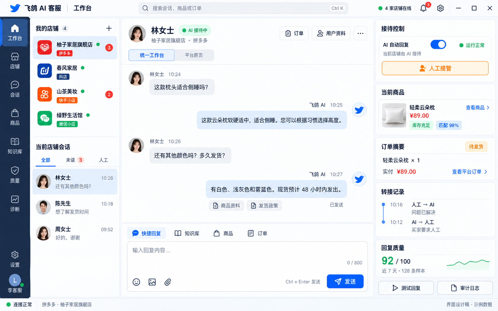

# 飞鸽 AI 客服综合开发文档

本文档是本项目的开发、UI、交互、数据、测试和交付基线。它把当前代码已经具备的能力、设计图希望达到的工作台体验、尚未实现的功能和真实平台验收门禁放在同一份文档中。标为“目标”或“待实现”的内容不能对外宣传为已完成。

文档版本：2026-09-16  
产品形态：Windows Electron 桌面端  
支持平台：拼多多、抖店、快手小店、微信小店  
最新设计稿：[主工作台 UI 设计图 V3](../design/ui-mockup-main-v3-workspace.png)

设计图中的订单号、评分、销量、回复质量和聊天内容均为展示用样例数据。它定义信息层级和交互位置，不代表当前运行时已经拥有这些数据。

V3 取代了早期设计稿，是当前新的主工作台视觉方向；当前工作区只保留 V3 设计图和对应的设计说明。

## 1. 产品范围、平台和边界

软件面向多店铺电商客服场景。每个店铺拥有独立浏览器分区、登录态、会话上下文、商品目录、规则、AI 配置和运行状态。登录由用户在平台页面完成；用户开启店铺 AI 后，系统可以在该店铺范围内按规则自动生成和发送回复。人工输入、快捷回复和测试回复仍是不同操作，测试回复永远不能触达真实买家。

| 面向用户的平台名 | 内部 ID   | 现有客服页面         | 当前代码状态                           |
| ---------------- | --------- | -------------------- | -------------------------------------- |
| 拼多多           | pinduoduo | 拼多多商家客服工作台 | 有平台适配代码，真实账号验收待完成     |
| 抖店             | feige     | 飞鸽客服工作台       | feige 是历史兼容 ID，UI 必须显示“抖店” |
| 快手小店         | kuaishou  | 快手小店客服         | 有平台适配代码，真实账号验收待完成     |
| 微信小店         | weixin    | 微信小店客服         | 有平台适配代码，真实账号验收待完成     |

内部 ID、配置键、数据库字段和迁移脚本继续使用现有值，以免破坏已有店铺数据。平台注册表中的旧名称只用于兼容层，所有新的导航、筛选、空状态、Toast 和文案必须使用上表的四个 UI 名称。产品范围不包含淘宝或其他未列出的平台。

登录、重新登录和页面内的最终确认由用户在平台页面完成。系统只使用已经打开的受控页面完成经用户授权的客服操作；开启 AI 是店铺级授权，不要求用户逐条确认自动回复。

## 2. 当前代码架构和运行事实

主链路为：

    electron/main.ts
      -> src/backend.ts 的 createBackend
      -> ShopSupervisor
      -> ShopInstance
      -> WebviewClient / VisionClient
      -> SQLite repos、ModelGateway、RuleEngine

渲染器位于 renderer，通过 electron/preload.ts 暴露的白名单 IPC 与主进程交互。Electron 主进程负责窗口、WebContentsView、IPC、生命周期和权限边界；业务层负责店铺编排、消息处理、AI 决策、转人工、监控和学习；React 层负责展示状态和发起用户操作。

主界面为 V3 三栏工作台：左侧组合导航与店铺/会话区、中央统一消息工作台（可切换平台原页）、右侧接待控制面板，再加顶部栏/底部状态栏。App.tsx 在统一工作台模式下渲染 SessionTimeline，切换平台原页时由主进程挂载 WebContentsView；右侧 WorkspacePanel 显示 AI/健康/接管/转接/商品/订单/质量/快捷操作并接真实 IPC。布局协调器 useWorkspaceLayout 按窗口宽度推导组合 sidebar 与右侧面板尺寸并上报 workspace:setLayout，主进程据此统一计算 WebContentsView bounds。SettingsPanel 当前已经有 13 个模块：系统配置、商品管理、规则引擎、知识库、会话查看、意图分析、人工坐席、学习系统、日志告警、审计日志、运营指标、软件更新和健康监控。

平台文案已统一为「抖店」；feige 只保留在内部 ID、配置和数据库兼容层。顶部全局搜索入口已接入 search:global，当前按消息、店铺、商品和订单四类分组，点击结果会定位店铺或管理模块；工作台和右侧面板提供附件选择入口，但平台级附件发送仍遵循 manual_only，最终发送必须回到平台原页并由人工确认。

SQLite 当前保存店铺、状态、上下文、审计、反馈、质量、学习、意图、转接队列、坐席、去重、业务配置、待处理消息、对话状态和买家画像。商品和大多数知识库内容由 data/shops 下的 JSON 文件管理；默认规则、标准模板和部分配置仍来自项目 config 目录。当前实现不应被描述成“所有业务数据都在 SQLite”。

### 2.1 当前运行快照

下列结果来自 2026-09-16 本轮实现后的本机验证，下一次代码变更后需要重新执行：

| 项目                | 结果                                                                |
| ------------------- | ------------------------------------------------------------------- |
| 主进程 TypeScript   | 通过                                                                |
| Renderer TypeScript | 通过                                                                |
| ESLint              | 通过；现有脚本只检查 src                                            |
| Unit                | 52 套件 / 550 项通过                                                |
| Renderer            | 20 套件 / 106 项通过                                                |
| Chaos               | 11 套件 / 42 项通过                                                 |
| E2E                 | 13 套件 / 34 项通过，平台 DOM、LLM 和视觉服务均为 mock              |
| Integration         | 6 套件 / 24 项通过（含真实 OCR 识别与 DPI 换算）                    |
| 工作台真机验证      | 通过；三栏布局、消息时间线、发送输入框、订单/附件卡均实测渲染；1264 DIP 下抖店右侧控制面板宽 320 |
| 视觉真实识别        | 通过；vision/selfcheck.py 在合成截图上识别出买家/卖家文本并正确分类 |
| electron:build      | 通过                                                                |
| electron:pack       | 通过；已生成 `飞鸽AI客服 Setup 2.0.0.exe`（NSIS，未签名）           |
| 打包启动 smoke      | 通过；从系统临时目录启动，配置从 asar 读取，数据写入 userData       |
| 视觉 Python         | 已用 Python 3.11 重建 venv 并安装 cv2/paddleocr/pywin32/numpy       |

基线总计是 102 套件 / 756 项，全部通过。历史审查报告和旧 README 中的数字不能替代此快照。

上一轮审查保留的四个隔离复现（ManualMode 下仍自动回复、关闭 AI 后仍延迟发送、A/B 快速切店被迟到响应改回、退出视图后被迟到切换重新挂载）已通过 controlEpoch 发送闸门与串行视图队列修复，并在单元测试中覆盖。

## 3. UI 设计基线

### 3.1 视觉和尺寸

- 设计图尺寸为 1586×992；开发布局基准为 1440×900，最低支持 1000×700。
- 继续使用 shared/ui-layout.json 的顶部栏 60 DIP、底部状态栏 30 DIP；现有平台原页布局的左侧栏默认 276 DIP。
- V3 统一工作台参考：以 1586×992 设计图为基准，组合左侧区域约 382 DIP（96 DIP 窄导航加店铺/会话列表），右侧操作面板约 386 DIP，中央会话区自适应，区间间距 16 DIP。
- 1200 至 1439 DIP：右侧面板保持 320 DIP；中央区低于 560 DIP 时允许收起右侧面板，收起状态必须在顶部保留可恢复按钮。
- 1000 至 1199 DIP：左侧栏折叠为图标栏，右侧面板默认收起，中央会话区至少保留 640 DIP。
- 所有尺寸以 Electron content bounds 的 DIP 为准，不能用 CSS 像素直接覆盖 WebContentsView。窗口缩放、系统 125%/150% 缩放和窗口 resize 都要重新计算边界。
- 颜色、间距、圆角、阴影和按钮状态以设计图为基准。按钮必须实现默认、悬停、按下、禁用、加载和失败状态。

### 3.2 应用外壳

| 区域         | 设计内容                                                            | 目标交互                                                                                 |
| ------------ | ------------------------------------------------------------------- | ---------------------------------------------------------------------------------------- |
| 顶部栏       | 产品名、全局搜索、连接状态、通知、设置和窗口控制                    | 搜索订单/用户昵称/商品/问题关键词；连接状态进入诊断；通知打开告警面板                    |
| 左侧导航     | 工作台、店铺、会话、商品、知识库、质量分析、系统诊断                | 切换模块并显示未读数、店铺数、告警数                                                     |
| 店铺列表     | 四平台标签、店铺名称、登录状态、运行状态、未读数、AI 开关           | 点击店铺进入工作台；更多菜单提供启动、停止、刷新、重新登录、重命名、测试回复、配置和删除 |
| 中央会话区   | 店铺/买家标题、消息时间线、订单与用户资料入口、商品卡、回复编辑器   | 收消息、查看历史、选择会话、引用快捷回复、发送文字或附件                                 |
| 右侧操作面板 | AI 开关、健康状态、人工接管、转接记录、商品匹配、回复质量、快捷操作 | 影响自动发送的操作显示当前状态、操作者、时间和结果                                       |
| 底部状态栏   | 最近操作、连接状态、错误和更新时间                                  | 使用 aria-live=polite 通知异步状态；店铺未登录显示“未登录”，登录中显示“登录中”，只有已登录才显示“连接正常” |

当前代码的 WebContentsView 不应直接盖住右侧 React 区。新增统一工作台时，要由一个布局协调器同时计算 V3 的组合 Sidebar、React 区和 WebContentsView 的 bounds；弹窗打开时先隐藏或压缩 WebContentsView，关闭后按最新 bounds 恢复。

### 3.3 导航和现有组件映射

| 设计图入口 | 目标路由/视图 | 当前组件或模块                                                        | 当前状态                                        |
| ---------- | ------------- | --------------------------------------------------------------------- | ----------------------------------------------- |
| 工作台     | workspace     | App.tsx、Sidebar、TopBar、StatusBar、SessionTimeline、Webview manager | V3 统一消息区、平台原页切换和右侧控制面板已接入 |
| 店铺       | shops         | Sidebar 店铺列表、shop IPC                                            | 已实现列表、添加、切换、启动/停止和账号操作     |
| 会话       | conversations | SessionViewer、MessageThread                                          | 已接入左侧导航；历史查看与工作台实时流均可用    |
| 商品       | products      | ProductManager、ProductSyncService                                    | 已有 JSON 商品管理和同步链路                    |
| 知识库     | knowledge     | KnowledgeBase、TemplatePanel、ReviewPanel、VersionPanel               | 已有文件版模板/FAQ/版本流程                     |
| 质量分析   | quality       | MetricsPanel、IntentPanel、AuditLogViewer、LearningPanel              | 已有数据面板；评分不是事实准确率                |
| 系统诊断   | diagnostics   | HealthDashboard、DiagnosticsPanel、LogAlertPanel                      | 已接入左侧导航；视觉 ready 仍需真实运行时       |
| 设置按钮   | settings      | ConfigPanel、LlmProvidersPanel、ShopBusinessConfigEditor、AgentPanel  | 已有设置中心                                    |

设计图中的“订单”和“用户资料”是工作台上下文入口。当前代码有买家画像 IPC 和平台页面中的订单信息脚本，但没有独立订单仓库、订单搜索和订单操作 API；实现时先做只读订单摘要和原页跳转，不虚构发货、退款或改价能力。

### 3.4 页面规格

#### 3.3.1 左侧导航实际行为（2026-09-16）

左侧七个入口已经与现有模块完成路由映射：工作台和店铺回到三栏工作台；会话进入 `SessionViewer`；商品进入 `ProductManager`；知识库进入 `KnowledgeBase`；质量进入 `MetricsPanel`；诊断直接进入 `DiagnosticsPanel`；健康指标仍可在管理中心的健康监控页查看。导航按钮使用受控 `activeNav`，管理模块通过 `SettingsPanel.initialTab` 打开对应页，并将当前模块写入 `settingsTab` 以便刷新后恢复。设置按钮仍打开系统配置页。当前路由是桌面端内存路由，不新增 URL，切换管理模块前会先退出平台 WebContentsView，避免网页遮挡管理内容。

#### 工作台

进入工作台时显示当前店铺、平台标签、登录状态、运行状态和 AI 状态。中间区支持会话列表、消息时间线、输入框、快捷回复、知识库推荐、商品匹配和只读订单摘要。没有活跃店铺时显示空状态和打开设置入口；店铺未登录时显示“去平台页面登录”，不能显示健康或自动回复成功。

#### 店铺管理

添加店铺弹窗只列出拼多多、抖店、快手小店和微信小店。新增店铺默认 autoReply=false、未登录和无活跃会话。删除、停止、重新登录需要二次确认；人工接管和关闭 AI 立即生效，不应再加一个延迟确认弹窗。

#### 会话查看

支持按店铺筛选、全部/未读/人工会话筛选、会话搜索、消息搜索、分页/数量提示、消息时间线、审计入口和重试。未读筛选依据最近一条消息方向，人工筛选依据会话是否出现人工发送记录；没有对应会话时显示明确空状态。每一个请求带 shopId、sessionId 和 viewRevision；旧请求返回时如果 revision 不匹配就丢弃，不能覆盖当前会话。

#### 商品和知识库

商品卡显示名称、价格、库存、销量、匹配度和查看商品入口。同步显示来源、进度、导入/更新/跳过/错误数量；失败时保留旧目录。知识库显示模板、FAQ、规则、版本、审核人、审核时间、回滚和导入导出状态。

#### 质量分析和系统诊断

质量页展示回复质量、审计、反馈和趋势，并显示样本数、统计区间和最近更新时间。QualityEvaluator 当前实际是 5 个维度：confidence 0.30、latency 0.15、structure 0.15、safety 0.20、feedback 0.20；分值 0 到 1，UI 转成百分比，不能标成“回答事实准确率”。

诊断页分开显示配置、Node、Python、模型、文件、WebContentsView、CDP 和数据库检查。每项只有通过、警告、失败、跳过四种状态；mock 进程句柄不能作为视觉服务 ready。

### 3.5 设计图控制点到实现要求

| 控件编号 | 设计图控制点                           | 点击后的行为                                         | 必须补齐的实现                                 |
| -------- | -------------------------------------- | ---------------------------------------------------- | ---------------------------------------------- |
| W01      | 全局搜索框                             | 输入后展示消息、店铺、商品和订单结果，点击可定位   | global-search IPC、取消旧请求、权限和空状态    |
| W02      | 在线下拉                               | 查看连接摘要并进入诊断                               | 只读状态；不得伪造为在线                       |
| W03      | 通知徽标                               | 打开告警列表并定位来源                               | alert:list、acknowledge、实时事件              |
| W04      | 平台标签                               | 筛选四个平台                                         | display name 与 feige 兼容映射                 |
| W05      | 店铺 AI 开关                           | 店铺级开关，开启一次确认                             | 主进程校验登录/配置，广播状态                  |
| W06      | 店铺更多菜单                           | 启动、停止、刷新、重登、重命名、测试回复、配置、删除 | 操作结果、错误、重试和审计                     |
| W07      | 订单按钮                               | 查看只读订单摘要或跳转平台原页                       | order snapshot API；无订单时明确空状态         |
| W08      | 用户资料按钮                           | 打开买家画像、标签和备注                             | buyer profile 归属校验和保存状态               |
| W09      | 消息时间线                             | 加载历史和实时消息，标出来源/状态                    | 独立平台消息模型和稳定 messageId               |
| W10      | 商品卡                                 | 查看商品和匹配依据                                   | product list/get；展示同步时间                 |
| W11      | 快捷回复/知识库/商品/订单/客户画像 Tab | 插入模板、推荐商品或摘要                             | 统一 composer 草稿，不改变当前会话             |
| W12      | 表情、图片、文件、文字工具             | 选择内容并进入待发送状态                             | attachment IPC、大小/类型校验、发送回执        |
| W13      | 人工接管按钮                           | 立即进入 ManualMode 并停止 AI 自动发送               | 等待状态转换、失效 in-flight 任务              |
| W14      | 发送按钮                               | 按当前 shop/session 发送人工消息                     | 发送前重新定位会话，幂等 clientMessageId       |
| W15      | 转接记录                               | 查看本会话转接时间线                                 | transfer_events 持久化；区分页面转接和通用接管 |
| W16      | 回复质量卡                             | 查看样本、区间、维度和审计                           | quality_scores 与 audit 归属校验               |
| W17      | 测试回复                               | 在隔离上下文测试 AI                                  | 继续使用 test:reply，禁止写入真实发送 guard    |
| W18      | 审计日志                               | 打开按店铺/会话筛选的审计                            | audit:list 分页、导出权限和错误重试            |

### 3.6 无障碍和弹窗

- 弹窗使用 role=dialog 和 aria-modal=true，打开后焦点进入，Tab 在弹窗内循环，Esc 关闭并恢复原焦点。
- Tab、Dropdown、Switch、Radio 和按钮支持键盘操作，并暴露名称、选中、忙碌和错误状态。
- 店铺行采用可聚焦按钮语义；行内菜单不能造成嵌套交互元素的键盘冲突。
- 最低窗口尺寸不能产生页面级水平溢出；平台页面区域可以缩放和滚动。
- 网络、IPC、平台登录、视觉服务和数据库错误都要显示用户可理解的错误、重试入口和最近一次更新时间。

### 3.7 抖店专属适配

- 抖店内部平台 ID 继续使用 `feige`，用户界面和开发文档统一显示“抖店”。
- 会话列表同时兼容旧版 `.pigeonChatScrollBox .auxo-dropdown-trigger` 和当前新版 `.auxo-dropdown-trigger`；新版候选必须满足会话区域位置、尺寸和时间/状态摘要条件，避免误点顶部导航下拉项。
- 新版列表中的空 `auxo-badge` 仅是装饰节点，不参与未读判断；“系统关闭会话/会话已关闭”历史记录直接过滤，后台轮询只处理真实未读或有效会话摘要。
- 当前会话 ID 优先从 `aria-selected`、`active`、`selected` 的抖店会话项提取，并过滤“最近联系、平台消息、快捷短语”等导航文本。
- 登录检测优先使用 `.chatd-root`、`.chatd-default`、`#rootContainer` 等客服工作台特征，登录过期仍以 URL 和平台过期文案为准。
- 抖店真实账号验收仍需覆盖：登录过期重登、当前会话/最近联系切换、买家消息收取、人工文字回复回显、AI 开关、人工接管、页面转接、订单摘要、商品同步和 WebContentsView 恢复。

## 4. 交互和状态规范

### 4.1 启动和店铺切换

1. 启动时先读取应用资源中的只读 config，再读取 userData 下的可写数据。
2. 店铺列表显示加载中；数据库失败显示错误和重试，不显示空店铺。
3. 用户点击店铺后，UI 标记切换中并阻止同一目标重复点击。
4. 主进程校验 shopId，按平台 ID 取得 URL，执行 ensureAndMount。
5. 只有挂载成功才更新 activeShopId 和已读状态；失败时保留原店铺。
6. 切换和退出视图共用一个真正延迟执行的 IPC 队列，队列记录递增 viewRevision；后发操作拥有最终优先级。

### 4.2 AI 自动回复

- 新店铺默认关闭 AI。
- 开启 AI 时确认一次店铺、平台、登录状态和自动发送范围。开启后不要求逐条人工确认。
- 关闭 AI 后，停止新的自动生成、自动发送和会抢占平台页面焦点的扫描；被动收消息、历史记录和人工手动发送仍可用。
- 关闭开关时递增 controlEpoch，使生成中任务在发送前失效，并持久化到店铺配置。
- 主进程重新校验 shopId、布尔值、登录状态和目标会话，不能信任 renderer 传来的状态。

### 4.3 人工接管和释放

人工接管是发送保护和会话优先级控制：

1. 接管请求等待 ShopStateMachine 的状态转换 Promise 完成。
2. 进入 ManualMode 后停止该店铺的 AI 生成、自动发送和主动视觉点击。
3. 生成中任务使用 controlEpoch/取消令牌失效；发送入口再次检查 ManualMode、AI 开关、登录状态和会话版本。
4. UI 显示接管时间、操作者、未发送任务数和人工发送按钮。
5. 释放时清理会话级转人工标记，确认目标状态后才恢复 AI。
6. 不存在店铺、已停止店铺或转换失败必须返回明确错误，不能用可选链静默成功。

人工接管本身不要求确认弹窗，因为它是立即降低自动发送风险的操作。支持页面级转接的平台必须收到页面确认回显后才发出成功事件；其他平台显示“通用人工接管”，不能宣称已分配给具体坐席。

### 4.4 消息时间线和发送

- 平台消息绑定 shopId、sessionId、messageId、来源、方向、时间、发送状态和原始平台引用。
- 当前 conversation_context 只用于 LLM 上下文，不能直接当作完整平台消息历史。
- 生成前后检查店铺状态、AI 开关、登录状态、会话版本和 controlEpoch。
- sendReply 接口改为接收 shopId、sessionId、messageVersion、clientMessageId 和内容；发送前重新定位平台当前会话。
- 成功回显后才写入 delivery guard、审计和质量数据。超时进入待确认状态，不能直接重发造成重复消息。
- 用户切换会话、退出视图或人工接管时，取消旧草稿和未发送自动任务；人工草稿按 shopId + sessionId 保存并恢复。
- 快捷回复和人工发送可以共享同一个目标会话发送通道；test:reply 必须使用隔离的预览通道。

### 4.5 附件

第一期支持图片和普通文件的选择、预览、大小/扩展名检查、取消和失败重试。附件先进入本地 outbox，拿到平台回执后才标记 sent。没有平台级附件能力时，UI 显示“请在平台页面发送”，不能伪造发送成功。附件不进入 LLM 文本上下文，只保存受控的本地路径、哈希、类型和回执。

### 4.6 转人工

转人工按钮需要 reason、sessionId 和可选角色。当前只有 feige 有页面级 adapter；拼多多、快手小店、微信小店执行通用人工接管。新增 transfer_events 表记录 requested、succeeded、failed、manual_only、operator、reason 和时间，事件通知与持久化使用同一个结果。

### 4.7 商品、订单和买家

- 商品匹配使用当前店铺目录和匹配依据，卡片显示同步时间和数据新鲜度。
- 订单入口只读显示订单摘要、来源平台和跳转原页；发货、退款、改价等交易动作暂不列入本版本能力。
- 买家画像继续按 shopId、platform 和稳定 buyerId 归属；仅有昵称时必须标为低置信度，不能把同名买家合并。
- 买家标签、备注和反馈保存后显示操作者、时间和失败重试。

### 4.8 设置、知识库和 Provider

设置模块均有加载、空数据、保存中、保存成功、保存失败和重试状态。知识库发布走权限与审核流程。Provider 页面显示启用状态、默认 Provider、层级、模型、Key 掩码、测试结果和重启提示；Key 只写入 DPAPI 或系统环境变量。

## 5. 状态机、能力矩阵和后台行为

店铺状态包括 Healthy、Degrading、VisualMode、Recovering、SilentWait、ManualMode 和 Error。所有状态切换通过 ShopStateMachine.transition() 串行执行；调用方依赖新状态时必须等待 Promise 或监听 transition 事件。

| 能力               | CDP 模式              | 视觉模式               | 未登录/停止    | ManualMode       |
| ------------------ | --------------------- | ---------------------- | -------------- | ---------------- |
| 被动接收和记录消息 | 支持                  | 识别能力取决于视觉服务 | 停止           | 可保留已发现消息 |
| AI 生成            | 开启且满足条件时支持  | 当前仅部分识别链路     | 停止           | 停止             |
| 自动发送           | 需平台回执            | 当前不完整             | 停止           | 停止             |
| 人工文字发送       | 平台页面可用时支持    | 平台页面可用时支持     | 按登录状态显示 | 支持             |
| 图片/文件发送      | 待实现                | 待实现                 | 停止           | 可人工发送       |
| 页面级转接         | 仅 feige 已有 adapter | 取决于页面             | 不可用         | 可保留人工状态   |

视觉客户端只有收到 vision service ready 才算启动。启动失败、主动停止和超时不能触发重复重启。视觉 OCR 当前使用 visual_default 和 timestamp 0，必须改为稳定 sessionId、递增消息 ID 和单调时间；没有稳定关联时只能识别并提示人工，不能自动发送。

## 6. IPC 契约

所有来自 renderer 的数据在主进程再次校验。变更类接口统一返回 ok、error 和可选 revision；查询类接口失败时返回可识别错误，不把数据库异常伪装成空列表。

### 6.1 当前可复用 IPC

| 领域           | 已有通道                                                                                                                                                              | 用途                                 |
| -------------- | --------------------------------------------------------------------------------------------------------------------------------------------------------------------- | ------------------------------------ |
| 店铺           | shop:list、shop:addAccount、shop:removeAccount、shop:switchView、shop:exitView、shop:start、shop:stop、shop:setAutoReply、shop:takeover、shop:release | 店铺、切换、启动与 AI/人工接管 |
| 会话           | conversation:sessions、conversation:messages、conversation:search                                                                                                     | 历史会话和消息查看                   |
| 商品           | product:list、product:get、product:add、product:update、product:delete、product:import、product:sync、product:syncStatus                                              | 商品管理和同步                       |
| 规则/知识库    | rule:_、faq:_、kb:*                                                                                                                                                   | 规则、模板、FAQ、审核、版本和权限    |
| LLM            | config:getLlmProviders、config:getLlmApiKey、config:updateLlmApiKey、config:updateLlmProvider、config:testLlmProvider、config:setDefaultLlmProvider                   | Provider 配置和测试                  |
| 监控           | metrics:_、alert:_、diagnostic:_、diagnose:run、log:_                                                                                                                 | 指标、告警、诊断和日志               |
| 坐席/买家/反馈 | agent:_、buyer:_、feedback:_、learning:_、intent:*                                                                                                                    | 人工协同、画像、反馈和学习           |
| 预览           | test:reply                                                                                                                                                            | 隔离的 AI 回复测试                   |

实际 renderer API 的商品同步状态调用 product:syncStatus；文档和实现统一使用这个通道名。

### 6.2 统一工作台待新增 IPC

| 通道                        | 请求关键字段                                             | 结果和限制                                                 |
| --------------------------- | -------------------------------------------------------- | ---------------------------------------------------------- |
| workspace:getSnapshot       | shopId、sessionId、viewRevision                          | 返回能力、当前会话、草稿、AI/健康状态和数据时间            |
| conversation:stream         | shopId、sessionId、afterMessageId                        | 推送新增平台消息；断线可用 afterMessageId 补齐             |
| conversation:sendText       | shopId、sessionId、messageVersion、clientMessageId、text | 绑定目标会话，返回 queued/sent/failed/pending_confirmation |
| conversation:sendAttachment | 同上加文件元数据                                         | 白名单类型和大小；没有平台能力返回 manual_only             |
| conversation:draft          | shopId、sessionId、draft                                 | 本地持久化，切换会话不串草稿                               |
| search:global               | query、types、shopIds、limit                             | 分页、取消旧请求、按权限过滤                               |
| order:summary               | shopId、sessionId、orderRef                              | 只读摘要和平台原页 URL                                     |
| transfer:history            | shopId、sessionId、cursor                                | durable transfer_events，区分页面转接/通用接管             |
| workspace:setLayout         | sidebar、rightPanel、zoom、windowRevision                | 主进程统一计算 WebContentsView bounds                      |

以上通道已在本轮实现（见第 8 节状态）。仍需注意：`conversation:sendAttachment` 在没有平台级附件能力的平台上只返回
`manual_only`，不会伪造发送成功；`order:summary` 只返回已缓存的只读快照。真实平台附件发送、订单抓取和分页/权限过滤
需要在真实账号环境下继续验收。

## 7. 数据模型、持久化和恢复

当前默认配置的 data_dir 是项目下的 ./data；electron/main.ts 和 backend.ts 还依赖 process.cwd() 读取配置或数据。目标发布实现为：只读资源使用 app.getAppPath()/resources，写入数据使用 app.getPath('userData')，并提供首次启动迁移和回滚提示。

### 7.1 已有数据

SQLite 表包括 conversation_context、shop_state、metrics、ai_reply_audit、dialogue_feedback、quality_scores、learned_patterns、learning_runs、intent_classification、escalation_queue、human_agents、reply_delivery_guard、shop_business_config、pending_messages、dialog_state 和 buyer_profiles。

店铺商品、模板、FAQ、规则、权限和版本目前分布在 data/shops、config/rules、config/templates 和 data/reviews。备份任务必须按实际文件路径收集，不能只备份 SQLite。

### 7.2 统一工作台新增数据

| 数据                  | 建议存储              | 必填键                       | 恢复要求                                               |
| --------------------- | --------------------- | ---------------------------- | ------------------------------------------------------ |
| conversation_messages | SQLite                | shopId、sessionId、messageId | 按 messageId 幂等写入，保留方向/来源/回执              |
| message_outbox        | SQLite + 本地附件目录 | clientMessageId              | queued/sending/sent/failed/pending_confirmation 可恢复 |
| conversation_drafts   | SQLite                | shopId、sessionId            | 切换和重启后恢复最近草稿                               |
| transfer_events       | SQLite                | shopId、sessionId、eventId   | 事件和通知一致，重复事件幂等                           |
| order_snapshots       | SQLite 缓存           | shopId、sessionId、orderRef  | 过期显示时间，失败保留旧摘要                           |
| global_search_index   | 可重建索引            | shopId、entityType、entityId | 删除或迁移后可重建                                     |

反馈写入前先验证 auditId 属于传入 shopId 和 sessionId，再写反馈、质量和学习数据。关闭数据库前等待备份、学习、分析、上下文和 outbox 定时任务结束。备份默认保留 app.backup_retention_count 的 30 份；Cookie、Key、日志和店铺会话不得提交版本控制。

Electron 安全基线保持 contextIsolation=true、nodeIntegration=false、sandbox=true；平台导航使用精确 hostname 白名单；renderer 只获得固定参数的白名单 IPC。

## 8. 功能缺口和实现清单

下表是当前实现与目标设计之间的可执行任务。完成条件同时包含代码、测试和 UI 状态。

| ID                     | 优先级 | 状态       | 实现与验收                                                                                                     |
| ---------------------- | ------ | ---------- | -------------------------------------------------------------------------------------------------------------- |
| UI-PLAT-001            | P2     | 已完成     | 文案统一抖店；保留 feige 内部 ID；四平台列表与空状态已实现                                                     |
| FEIGE-DOM-001         | P1     | 已完成本轮 | 抖店新版 auxo 会话项选择器、装饰徽标误判修复、关闭历史会话过滤、导航误点过滤、当前会话 ID 提取和客服工作台登录特征已补齐；真实账号闭环仍待验收 |
| UI-WORKSPACE-001       | P1     | 已完成     | 三栏工作台；布局计算抽到 src/workspace/layout.ts 供渲染层与主进程共用；单测覆盖断点与不重叠；真机验证通过      |
| UI-SIDEBAR-001         | P2     | 已完成     | 导航入口映射 13 个设置模块；店铺菜单、未读、告警、登录态可见                                                   |
| UI-SEARCH-001          | P2     | 已完成     | 顶部全局搜索框 + search:global、结果分组、无结果状态、revision 丢弃迟到响应                                    |
| UI-SESSION-001         | P1     | 已完成     | 独立平台消息表 + conversation:stream/onMessage/draft/sendText + SessionTimeline UI（会话切换/草稿/幂等发送）   |
| UI-CONTROL-001         | P1     | 已完成     | 右侧 AI/健康/接管/转接/订单/附件/快捷操作卡接真实状态                                                          |
| SAFE-TAKEOVER-001      | P0     | 已完成     | 接管等待状态转换；入口、生成中、发送前检查；controlEpoch 使 in-flight 任务失效，含回归测试                     |
| SAFE-AI-OFF-001        | P0     | 已完成     | 关闭 AI 递增 controlEpoch，停止自动生成/发送/主动扫描；人工发送仍可用，含回归测试                              |
| UI-VIEW-001            | P1     | 已完成     | 切店/退出使用真正延迟执行的串行 IPC 队列 + revision 丢弃迟到响应                                               |
| MSG-SESSION-001        | P0     | 已完成     | 发送携带 sessionId/clientMessageId，发送前定位会话，outbox 幂等回执，含回归测试                                |
| MSG-ATTACH-001         | P1     | 部分实现   | 附件选择、白名单/大小校验、manual_only 提示已实现并接入 UI；平台级附件发送待平台真实能力                       |
| TRANSFER-HISTORY-001   | P1     | 已完成     | 持久化 transfer_events；页面转接/通用接管区分                                                                  |
| ORDER-SUMMARY-001      | P2     | 部分实现   | 只读订单摘要 order:summary/order:capture + order_snapshots 缓存；仅 feige 有页面 adapter                       |
| BUYER-ID-001           | P2     | 已完成     | 观察器提取稳定 buyerId（data-uid/openid）；缺失时标低置信度，不按昵称合并同名买家                              |
| VISION-RUNTIME-001     | P0     | 已完成     | venv 重建；修正 PaddleOCR 3.x 结果解析（原按 2.x 格式解析，实际识别不出内容）与 MKLDNN 崩溃；真实 OCR 自检通过 |
| VISION-DATA-001        | P1     | 已完成     | 稳定视觉 sessionId（按店铺）、bbox+文本哈希 messageId、真实采集时间；保留卖家气泡以正确判断"是否已回复"        |
| VISION-SEND-001        | P1     | 已完成     | 能力声明 getCapabilities 明确 visualAutoSend=false，UI 仅在 VisualMode 提示仅识别/需人工回复                   |
| VISION-DPI-001         | P1     | 已完成     | captureRegion 为 DIP、截图用物理像素，按 display.scaleFactor 换算，避免 125%/150% 缩放下截错区域               |
| DATA-PATH-001          | P0     | 已完成     | 资源/数据路径分离（src/paths.ts）；打包后从外部目录启动 smoke 通过，数据写入 userData                          |
| RELEASE-BUILD-001      | P0     | 已完成     | electron-builder 25.1.8 生成 NSIS 安装包；app.asar 内确认包含 config；安装/卸载 smoke 待干净机器               |
| DATA-OWNER-001         | P1     | 已完成     | feedback:add 先按 auditId 精确校验归属，再写反馈/质量/学习                                                     |
| UI-ERROR-001           | P1     | 已完成     | 不存在店铺返回明确错误；查询失败不伪装空数据                                                                   |
| PREVIEW-API-001        | P2     | 已完成     | browser mock 补 workspace/search/order/transfer/view/db/conversation/buyer 等 API                              |
| TRAINING-CLI-001       | P2     | 已完成     | CLI 改为加载 dist 编译产物，去除 BOM/TS 注解，新增 training:export 脚本                                        |
| TRAINING-LIFECYCLE-001 | P3     | 未实现     | 训练任务、评估、模型版本和部署回滚另立需求                                                                     |
| CI-GATE-001            | P1     | 已完成     | CI 补 renderer typecheck/build、lint、覆盖率门槛不再 continue-on-error、视觉 venv 重建、NSIS pack job          |
| REAL-ACCEPT-001        | P0     | 未完成     | 四平台测试店铺真实账号验收（需真实登录态，无法在开发环境完成）                                                 |
| DOC-BASELINE-001       | P2     | 已完成本轮 | README、本综合文档和历史审查报告标明同一快照日期与测试数字                                                     |

### 8.1 仍未完成的边界

以下内容无法仅靠代码完成，必须在具备真实环境的条件下验收：

- **REAL-ACCEPT-001（P0）**：四个平台各自的测试店铺完成登录、收消息、回复回显、商品同步、AI 开关、接管、转接、
  审计与崩溃恢复。这是发布前最重要的门禁，需要真实账号与真实页面。
- **RELEASE-BUILD-001 的安装/卸载 smoke**：安装包已生成，但在一台干净 Windows 机上的安装、升级保留店铺、
  卸载残留清理仍需人工执行。
- **MSG-ATTACH-001 / ORDER-SUMMARY-001 的真实平台能力**：附件受平台能力限制，订单抓取当前只有 feige adapter。
- **TRAINING-LIFECYCLE-001（P3）**：模型训练、评估、部署与回滚属另立需求，本版本只提供数据导出。

## 9. 验收用例和测试要求

### 9.1 自动化用例

| 用例        | Given                                 | When                 | Then                                                      |
| ----------- | ------------------------------------- | -------------------- | --------------------------------------------------------- |
| SAFE-01     | 店铺处于 Healthy 且 AI 生成中         | 用户点击人工接管     | 状态完成 ManualMode 后，生成结果不发送，UI 显示未发送任务 |
| SAFE-02     | AI 开关为 true 且生成任务延迟         | 用户关闭 AI          | 自动发送被 controlEpoch 拒绝；人工文字发送仍可用          |
| VIEW-01     | A、B 两店铺都可切换                   | 快速点击 A 再 B      | IPC 按队列执行，最终 activeShopId 为 B，迟到 A 响应被丢弃 |
| VIEW-02     | B 切换未完成                          | 用户退出视图         | 退出拥有更高 revision，迟到切换不会重新挂载               |
| MSG-01      | 当前会话为 S1，生成期间用户切到 S2    | 自动回复完成         | S1 任务取消或进入待确认，S2 不收到 S1 文本                |
| MSG-02      | 发送 clientMessageId 已存在 sent 回执 | 重试同一请求         | 返回原回执，不在平台重复发送                              |
| ATTACH-01   | 平台能力为 manual_only                | 用户选择图片         | 显示人工发送提示，不写 sent，不伪造回执                   |
| TRANSFER-01 | 平台页面转接未回显成功                | 点击转接             | 不发 success；记录 failed 或 pending，并保留 ManualMode   |
| DATA-01     | auditId 属于店铺 A                    | 用店铺 B 提交反馈    | 主进程拒绝，A 的质量和学习数据不变                        |
| SEARCH-01   | 同时发起两个关键词                    | 先返回旧关键词结果   | 旧结果因 revision 丢弃，只显示最新关键词                  |
| VISION-01   | Python 不存在或缺 cv2                 | 运行诊断             | 显示失败和修复指引，不显示视觉 ready                      |
| PATH-01     | 从安装目录、桌面、开始菜单启动        | 读取配置并写入数据库 | 只读资源找到，数据写入 userData，目录可写                 |

自动化测试使用 mock 平台时，断言业务状态和 IPC，不把 mock 回执当作真实平台证据；收消息和发送用例必须使用假数据，不得向真实买家发送测试内容。

### 9.2 真实平台验收矩阵

四个平台分别建立测试店铺和带时间、截图/回执、日志路径的验收记录，至少覆盖：

1. 页面登录、登录过期和重新登录。
2. 买家消息接收、连续消息合并、稳定 ID 和消息去重。
3. 规则命中、LLM 回复、敏感词拦截、审计和页面回显。
4. 商品匹配、商品同步、库存/价格异常和失败回滚。
5. AI 开关、人工接管、释放、接管期间自动发送停止和人工发送。
6. 页面级转接或通用人工接管的准确文案。
7. WebContentsView 崩溃、CDP 断线、视觉降级、恢复和告警。
8. 安装目录、桌面快捷方式、开始菜单启动和数据迁移。

## 10. 发布门禁、路径和资源

发布前依次执行：

    npm run lint
    npm run typecheck
    npm run test:all
    npm run renderer:build
    npm run electron:build
    npm run electron:pack

开发机运行时验收还需在 `npm run electron:start` 启动并开放 9222 后执行 `node scripts/dev/workspace-smoke.cjs`、`node scripts/dev/interaction-smoke.cjs`、`node scripts/dev/management-smoke.cjs` 和 `node scripts/dev/readonly-ipc-smoke.cjs`。这些脚本检查布局、导航、店铺选择、全局搜索、管理中心 13 个模块和查询型 IPC；它们不发送消息、不修改店铺设置。

CI 还必须单独执行 renderer 类型检查、renderer 构建、打包和视觉运行时诊断。electron-builder 的 files 白名单显式排除 config/.env、config/.env.* 和 config/production.yaml，不复制整个 node_modules。视觉运行时若不随包提供，安装器要下载、校验并报告版本，不能依赖开发机路径或未提交的 vision/venv。

安装 smoke 要验证安装、启动、登录页打开、userData 写入、升级保留店铺、卸载和残留清理。失败时保留日志和安装包哈希，不能把 electron:build 通过写成安装包可用。

## 11. 实施顺序

1. 完成 SAFE-TAKEOVER-001、SAFE-AI-OFF-001 和 MSG-SESSION-001，建立人工和会话发送闸门。
2. 完成 UI-VIEW-001、UI-WORKSPACE-001 和 UI-ERROR-001，修正多店铺切换、bounds 和错误反馈。
3. 建立 conversation_messages、outbox、drafts 和 transfer_events，并接入设计图的统一消息区和右侧控制面板。
4. 完成视觉运行时、稳定消息 ID 和视觉能力声明。
5. 修正资源/用户数据路径，纳入 electron-builder，完成干净机器安装 smoke。
6. 完成反馈归属、订单只读摘要、全局搜索和附件能力检测。
7. 补齐 CI 门禁、浏览器预览 mock 和训练数据导出 CLI。
8. 四个平台分别完成真实测试店铺验收；所有 P0/P1 门禁通过后才能提升为生产版本。

## 11.1 软件更新功能

软件更新由主进程统一管理，渲染进程只能通过 preload 白名单调用，避免网页内容获得下载、安装或退出应用权限。

| 能力 | 实现 | 交互 |
| --- | --- | --- |
| 检查版本 | `electron/update-manager.ts` + `electron-updater` | 设置中心「软件更新」点击“检查更新” |
| 下载更新 | 主进程关闭自动下载，收到可用版本后由用户确认 | 显示目标版本、版本说明和下载进度 |
| 安装更新 | 仅下载完成后允许 `quitAndInstall` | 用户点击“立即重启安装”，安装完成后启动新版本 |
| 状态推送 | IPC `app:update:state` | 顶部工具栏显示新版本提示点，设置页显示状态 |
| 发行源 | GitHub Releases：`Amike-cc/AI-customer-service` | 仅正式打包版本访问更新服务器，开发模式明确提示 |

主进程状态包括 `idle`、`checking`、`available`、`not-available`、`downloading`、`downloaded` 和 `error`。检查与下载互斥；更新失败保留错误信息并支持重试。更新不触碰 `userData` 下的店铺、会话、知识库和配置数据，升级验收必须确认这些数据仍可读取。

发布流程使用 `.github/workflows/release.yml`：推送 `v*` 标签后，在 Windows 2022 runner 构建 NSIS 安装包并发布 GitHub Release，同时生成 `latest.yml` 和更新包元数据。普通 CI 仍只构建和上传 artifact，不发布 Release。首次正式发布前需要在 GitHub 仓库确认 `GITHUB_TOKEN` 具有 `contents: write` 权限；未发布 Release 或缺少 `latest.yml` 时，客户端会显示检查失败，不能视为更新功能已完成验收。

更新验收：安装旧版本，发布更高版本，启动旧版本手动检查，确认可用版本信息、下载进度、重启安装和数据保留；再验证无更新、网络失败、重复点击、下载中关闭应用和安装失败后的重试路径。

## 12. 相关文件

- UI 资产（当前）：[design/ui-mockup-main-v3-workspace.png](../design/ui-mockup-main-v3-workspace.png)
- UI 设计说明和完整生成提示词：[design/ui-mockup-main-v3-workspace.md](../design/ui-mockup-main-v3-workspace.md)
- 主进程入口：[electron/main.ts](../electron/main.ts)
- 预加载白名单：[electron/preload.ts](../electron/preload.ts)
- React 入口：[renderer/src/App.tsx](../renderer/src/App.tsx)
- 设置中心：[renderer/src/components/settings/SettingsPanel.tsx](../renderer/src/components/settings/SettingsPanel.tsx)
- 平台注册表：[src/platform/registry.ts](../src/platform/registry.ts)
- 店铺实例：[src/shop/ShopInstance.ts](../src/shop/ShopInstance.ts)
- 状态机：[src/state/ShopStateMachine.ts](../src/state/ShopStateMachine.ts)
- 数据库迁移：[src/db/Database.ts](../src/db/Database.ts)
- 视觉安装脚本：[scripts/install-vision.js](../scripts/install-vision.js)
- 训练数据导出器：[src/training/TrainingDataExporter.ts](../src/training/TrainingDataExporter.ts)
- 更新管理器：[electron/update-manager.ts](../electron/update-manager.ts)
- 更新共享类型：[shared/update-types.ts](../shared/update-types.ts)
- 更新发布流水线：[.github/workflows/release.yml](../.github/workflows/release.yml)
- 历史代码审查：[.codex/review-20260913/项目代码与功能交互审查报告.md](../.codex/review-20260913/项目代码与功能交互审查报告.md)
